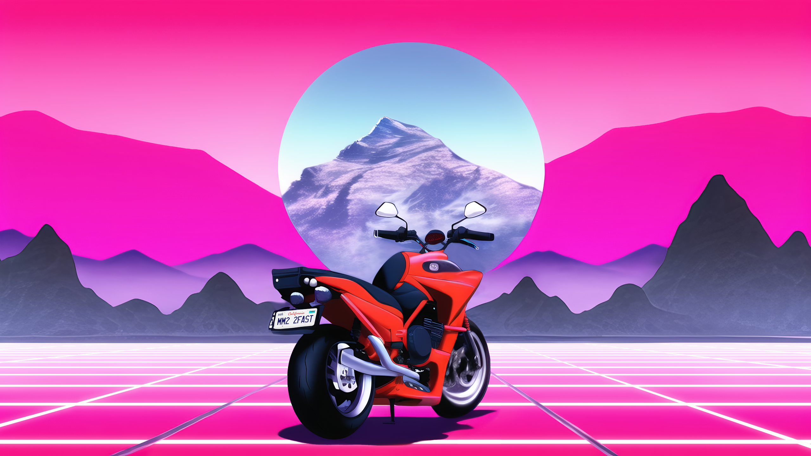

```{r, include = FALSE}
knitr::opts_chunk$set(
  collapse = TRUE,
  comment = "#>",
  fig.path = "figure/",
  fig.height = 1
)
```
## Introduction



outrunPalettes provides 4 outrun themed color palettes.

What is outrun? Maybe unsurprisingly, this is a hotly debated topic on the internet.
In lieu of me writing an essay, I'll provide some links that cover the art and music associated
with the style. But, broadly speaking, the art associated with outrun is characterized
by bright, neon colors, typically on a dark background. Themes are usually a mashup
of 80s/90s style with the occasional 80s-inspired retro-future aspect.
The music associated with outrun (also often called synthwave or retrowave) is
heavily influenced by 80s pop and electronic music, but with modern production value.

The name "outrun" is based on [the video game of the same name](https://en.wikipedia.org/wiki/Out_Run).
The game served as an inspiration for the genre, as it was packed with bright colors and
a very 80s-themed soundtrack.

The art is quite varied, but a decent example is the image at the top of the README.
Typical themes are 80s/90s vehicles and retro-futurism - [this medium article](https://medium.com/@cywjoel/outrun-the-aesthetic-deconstructed-dbd3cd8679b7)
has a good summary. Occasionally, this blends with a cyberpunk theme, most recently demonstrated by [Cyberpunk 2077](https://www.cyberpunk.net/us/en/) and [Blade Runner 2049](https://en.wikipedia.org/wiki/Blade_Runner_2049).

In terms of the music, there are tons of artists with slightly different takes on
the genre. A well-known and fairly representative example would be 
[The Midnight](https://www.youtube.com/watch?v=F7Qx7R655LI).

## Installation

You can install the development version of outrunPalettes from [GitHub](https://github.com/) with:

``` {r, eval = FALSE}
# install.packages("devtools")
devtools::install_github("sccallahan/outrunPalettes")
```

## Usage

```{r example}
library(outrunPalettes)

names(outrunPalettes)

```

The names aren't particularly clever, but they should be straightforward enough!

You can also see what a palette will look like by running:

```{r}
outrunPalette("pal1")
```

Of note, using the `type` argument, you can select "discrete" or "continuous." Using
"discrete" will give you up to a max of *n* colors per palette. At this time, every
palette consists of 5 colors. If "continuous" is selected, colors will be interpolated.

```{r}
x <- outrunPalette(name = "pal1", type = "continuous", n = 10)

print(x)
```

Hopefully, more palettes can be added in the future. If you have any suggestions, feel free to reach out!
