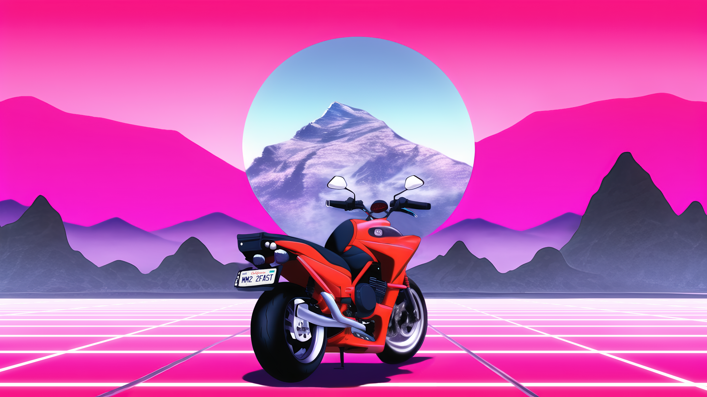

## Introduction



outrunPalettes provides 4 outrun themed color palettes.

What is outrun? Maybe unsurprisingly, this is a hotly debated topic on
the internet. In lieu of me writing an essay, I’ll provide some links
that cover the art and music associated with the style. But, broadly
speaking, the art associated with outrun is characterized by bright,
neon colors, typically on a dark background. Themes are usually a mashup
of 80s/90s style with the occasional 80s-inspired retro-future aspect.
The music associated with outrun (also often called synthwave or
retrowave) is heavily influenced by 80s pop and electronic music, but
with modern production value.

The name “outrun” is based on [the video game of the same
name](https://en.wikipedia.org/wiki/Out_Run). The game served as an
inspiration for the genre, as it was packed with bright colors and a
very 80s-themed soundtrack.

The art is quite varied, but a decent example is the image at the top of
the README. Typical themes are 80s/90s vehicles and retro-futurism -
[this medium
article](https://medium.com/@cywjoel/outrun-the-aesthetic-deconstructed-dbd3cd8679b7)
has a good summary. Occasionally, this blends with a cyberpunk theme,
most recently demonstrated by [Cyberpunk
2077](https://www.cyberpunk.net/us/en/) and [Blade Runner
2049](https://en.wikipedia.org/wiki/Blade_Runner_2049).

In terms of the music, there are tons of artists with slightly different
takes on the genre. A well-known and fairly representative example would
be [The Midnight](https://www.youtube.com/watch?v=F7Qx7R655LI).

## Installation

You can install the development version of outrunPalettes from
[GitHub](https://github.com/) with:

``` r
# install.packages("devtools")
devtools::install_github("sccallahan/outrunPalettes")
```

## Usage

``` r
library(outrunPalettes)

names(outrunPalettes)
#> [1] "pal1" "pal2" "pal3" "pal4"
```

The names aren’t particularly clever, but they should be straightforward
enough!

You can also see what a palette will look like by running:

``` r
outrunPalette("pal1")
```

<!-- -->

Of note, using the `type` argument, you can select “discrete” or
“continuous.” Using “discrete” will give you up to a max of *n* colors
per palette. At this time, every palette consists of 5 colors. If
“continuous” is selected, colors will be interpolated.

``` r
x <- outrunPalette(name = "pal1", type = "continuous", n = 10)

print(x)
```

<!-- -->

Hopefully, more palettes can be added in the future. If you have any
suggestions, feel free to reach out!
